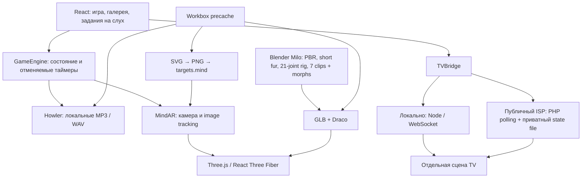

# Architecture

## Системы

## Текущее устройство (2026-10-01)



`/connect-tv` доступен без родительского hold gate. QR на телевизоре содержит
same-origin URL этой страницы с текущим кодом; после сканирования код уже заполнен,
подключение подтверждается кнопкой. QR генерируется локально, внешний сервис не нужен.
Родительский режим — защита от случайных нажатий, учётной записи/пароля нет.

Галерея имеет два задания: услышать название и выбрать животное, либо услышать
глагол и выбрать движение. Подсказки, повтор и похвала используют ту же очередь
озвучки и TV route; счёт и пользовательские данные на сервер не отправляются.

```text
React UI / Parent / routes
           ↓ events
Zustand store + pure finite state machine
           ↓ current state
GameEngine (timeline, dialogue, reactions, TV events)
    ├── AudioManager (Howler, recorded neural MP3/WAV, speech queue)
    ├── ARProvider interface
    │      └── MindARProvider (camera, controller, pose, Three renderer)
    └── TVBridge interface → WebSocketTVBridge / NoopTVBridge

SceneState → React Three Fiber / drei overlay scene
animals.ts → appearance beats, targets, audio IDs, reactions
localStorage → completed, available, volume, quality
Workbox precache → static app, markers, audio, models, icons, printables
```

`src/game/machine.ts` — чистая функция переходов. Animal states строятся как template literal types из AnimalId. Нет набора `isCatFound/showLion` boolean-флагов. `GameEngine` не импортирует MindAR, React или WebGL renderer; принимает state/event/audio/presentation через зависимости. Все отложенные действия принадлежат отменяемой timeline. Уход из сцены отменяет их, reset не оставляет запоздалого animalFound.

`src/ar/ARProvider.ts` — контракт initialize/registerTargets/start/stop/found/lost/reveal/quality/action. AR renderer принимает только настоящие target callbacks. `ARStage` лениво загружает адаптер после PLAY, показывает диагностику через отдельный store и освобождает provider при выходе. Video и Three canvas используют один crop/projection. Target pose нормализуется шириной карточки. На карточке, лежащей на столе, модель стоит наружу от плоскости; при почти фронтальном взгляде наклон мягко меняется для читаемости лица и тела.

Controller регулярно сравнивает все восемь целей, сбрасывая tracking-состояние
только между кадрами. SCAN ANY CARD открывает Free Play сразу. Начальное
совпадение использует уникальные боковые узоры: при компиляции общие подписи,
рамки и похожие центральные портреты исключаются, кластеры пересобираются.
Tracking сохраняет целое изображение. Нельзя ограничивать matcher только
ожидаемой целью. Логический anchor удерживается во время короткого повторного
warmup; подтверждение той же цели не повторяет реакцию. Tracking-тест проверяет
каждую карточку против семи чужих индексов. Порядок targets закреплён в
`scripts/marker-roster.mjs` и `src/config/animals.ts`; storyAnimals оставляет
озвученную историю из трёх глав.

`src/scenes/GameScene.tsx` — Foxy, fallback и camera-relative праздничная сцена. Финал сохраняет video; персонажи собираются в экранной сцене, поскольку обычное image tracking не обеспечивает floor/room anchors. Procedural geometry и эффекты ограничены; heavy postprocessing/shadow maps не используются.

## Lifecycle и память

- CAT загружается по immutable URL из `catAsset.ts` через GLTFLoader/DRACOLoader,
  клонируется с собственным скелетом через SkeletonUtils и анимируется AnimationMixer.
  GLB новой основы Milo содержит 21 сустав, семь skeletal clips, лицевые morphs,
  два взаимно исключающих слоя короткой шерсти и PBR-карты до 1024². Reveal shader
  работает с rest positions и наследует extras при разбиении меша по материалам.
  Источник текущей поставки — локальный `.deployment/incoming-milo/milo-game-short-fur.blend`.
  Остальные семь животных пока создаются `toyFactory.ts`; утверждение их качества
  и перенос на новый skeleton pipeline остаются отдельным этапом.
- AR стартует после PLAY, SCAN ANY CARD или открытия взрослой диагностики.
- Модели целей создаются лениво, при первом распознавании; скрытые не анимируются.
- Finale и TV используют один адаптивный `useCastLayout`, с двумя столбцами
  на телефоне и максимум четырьмя на широком экране.
- При закрытии provider: tracks.stop, stopProcessVideo, Worker.terminate, stop render loop, geometry/material.dispose, renderer.dispose, remove resize listener/video/canvas.
- При уходе React scene её геометрия освобождается. Внутри модели общая геометрия и материалы освобождаются один раз. Frame loop использует заранее найденные moving nodes, без повторного поиска или новых Vector3. Одновременно в финале нужны четыре персонажа.
- AUTO уменьшает render DPR до LOW при FPS ниже 25; эффекты имеют 8/16/24 элемента. Изменения качества не создают новый camera stream.
- При фоне игровые таймеры отменяются; при возврате текущая сцена запускается заново. Это предотвращает завершение миссии, пока ребёнок не видит экран.
- TensorFlow использует собственный WebGL backend. Его фактическое потребление памяти Safari нужно измерить на устройстве; JS heap не отражает весь GPU memory.

## Данные и расширение

`animals.ts` содержит слово, артикль, image/thumbnail, model path, target index, sounds, animation names, appearance beats и безопасные interactions. Чтобы добавить животное: добавить config/AnimalId, нарисовать отдельную цель, скомпилировать файл с правильным порядком, добавить локальные cue-файлы и placeholder/model. Основные переходы и GameEngine менять не требуется.

Storage сохраняет только четыре поля: completed, available, quality, volume. Состояние текущей камеры и transient mission не сохраняются; после relaunch всегда Welcome. Сбой storage не блокирует игру. Parent mode/debug не восстанавливаются автоматически после закрытия приложения.

## TV extension

WebSocketTVBridge подключается при явном pairing или восстановлении вкладки. Node relay обслуживает dist и `/tv-socket`, хранит комнаты в RAM. TV создаёт шестизначный код; роли получают отдельные случайные capability tokens, сохраняемые в sessionStorage для reconnect. SCENE_SYNC передаёт проверенное состояние, сервер назначает sequence и хранит последнюю сцену/released. Transfer: prepare → TV ready → commit с revealAt через 900 ms. Clock offset оценивается ping/pong. Потеря связи отменяет незавершённую передачу; reset очищает её. TV имеет отдельную Three-сцену и простой fallback при ошибке WebGL. Подробности: TV_SETUP.md.

На текущем ISP `PollingSocket.ts` передаёт тот же протокол через POST `/tv-poll.php`
с интервалом около 300 мс. PHP relay проверяет payload и capability token, блокирует
приватный JSON state через flock и ограничивает очереди/частоту запросов. State находится
вне web root. Данные камеры не передаются на relay. Ни Node backend, ни Python,
Blender или Kokoro не нужны на ISP для одиночной игры.

## Озвучка

Kokoro 82M используется только при подготовке ассетов. Восемь персонажей имеют разные базовые голоса и обработку высоты с сохранением темпа. Включены фразы действий, задания на слух и восемь оригинальных эффектов. `audio-lines.json` — исходные тексты и настройки; `manifest.json` — голос, фонемы, длительность и хеш каждого клипа; `generated.ts` — единый реестр для браузера. Серверы принимают только cue ID из manifest. В браузере нет модели, внешнего TTS или Web Speech. Howler играет MP3 с WAV fallback, завершает слово перед следующей фразой; смена сцены очищает очередь. Animal calls идут отдельным каналом. Остальные клипы загружаются по требованию вместо одновременной загрузки всех звуков.

Голос по умолчанию на iPad. Parent Mode выбирает TV после жеста unlock на телевизоре. AUDIO_CUE передаёт ID файла; AUDIO_ROUTE/readiness управляют одним источником. При недоступности TV следующая реплика звучит на iPad. Уже начатая реплика при сетевом разрыве автоматически не повторяется.
